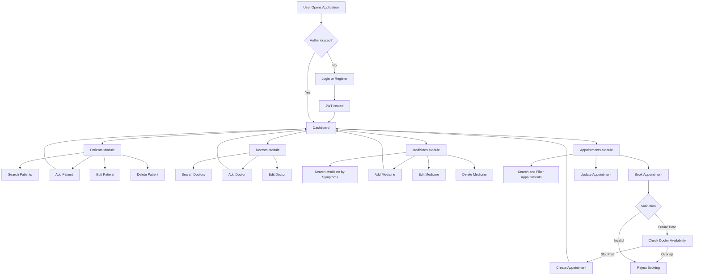
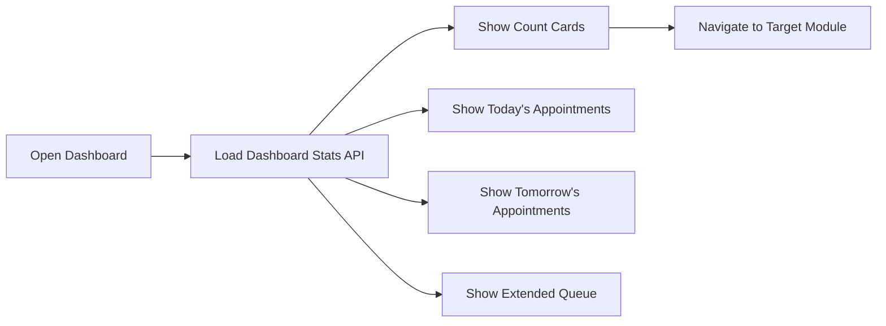

# 13. Flowchart

## 1. System Flowchart

```mermaid
flowchart TD
    A[User Opens Application] --> B{Authenticated?}
    B -- No --> C[Login or Register]
    C --> D[JWT Issued]
    D --> E[Dashboard]
    B -- Yes --> E

    E --> F[Patients Module]
    E --> G[Doctors Module]
    E --> H[Medicines Module]
    E --> I[Appointments Module]

    F --> F1[Search Patients]
    F --> F2[Add Patient]
    F --> F3[Edit Patient]
    F --> F4[Delete Patient]

    G --> G1[Search Doctors]
    G --> G2[Add Doctor]
    G --> G3[Edit Doctor]

    H --> H1[Search Medicine by Symptoms]
    H --> H2[Add Medicine]
    H --> H3[Edit Medicine]
    H --> H4[Delete Medicine]

    I --> I1[Search and Filter Appointments]
    I --> I2[Book Appointment]
    I --> I3[Update Appointment]

    I2 --> J{Validation}
    J -->|Future Date| K[Check Doctor Availability]
    K -->|Slot Free| L[Create Appointment]
    K -->|Overlap| M[Reject Booking]
    J -->|Invalid| M

    L --> E
    F2 --> E
    G2 --> E
    H2 --> E
```

## 2. Dashboard Flowchart

```mermaid
flowchart LR
    A[Open Dashboard] --> B[Load Dashboard Stats API]
    B --> C[Show Count Cards]
    B --> D[Show Today's Appointments]
    B --> E[Show Tomorrow's Appointments]
    B --> F[Show Extended Queue]
    C --> G[Navigate to Target Module]
```
