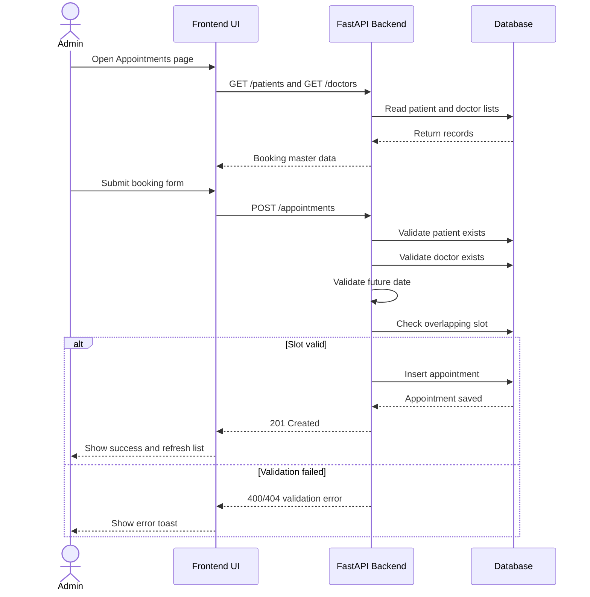
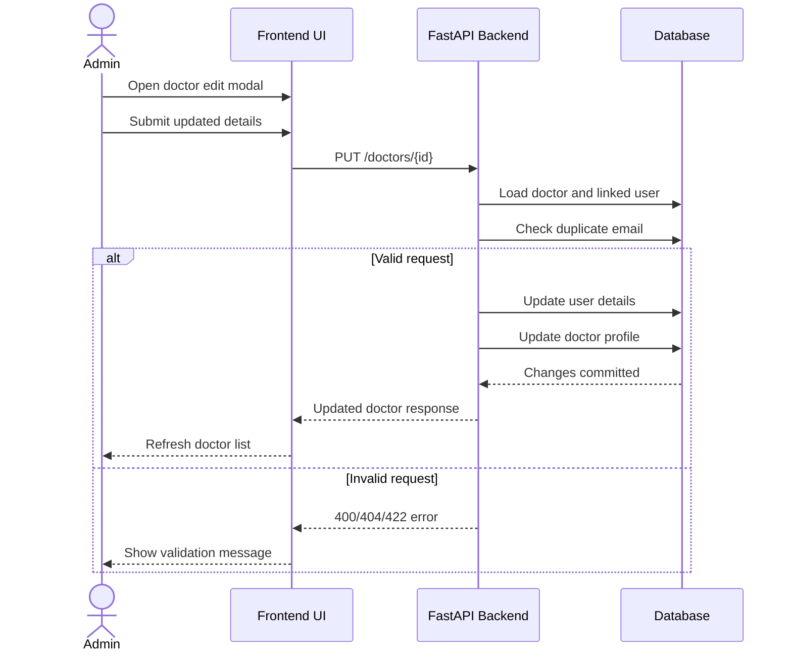

# 14. Sequence Diagram

## 1. Appointment Booking Sequence

```mermaid
sequenceDiagram
    actor Admin
    participant UI as Frontend UI
    participant API as FastAPI Backend
    participant DB as Database

    Admin->>UI: Open Appointments page
    UI->>API: GET /patients and GET /doctors
    API->>DB: Read patient and doctor lists
    DB-->>API: Return records
    API-->>UI: Booking master data

    Admin->>UI: Submit booking form
    UI->>API: POST /appointments
    API->>DB: Validate patient exists
    API->>DB: Validate doctor exists
    API->>API: Validate future date
    API->>DB: Check overlapping slot

    alt Slot valid
        API->>DB: Insert appointment
        DB-->>API: Appointment saved
        API-->>UI: 201 Created
        UI-->>Admin: Show success and refresh list
    else Validation failed
        API-->>UI: 400/404 validation error
        UI-->>Admin: Show error toast
    end
```

## 2. Doctor Update Sequence

```mermaid
sequenceDiagram
    actor Admin
    participant UI as Frontend UI
    participant API as FastAPI Backend
    participant DB as Database

    Admin->>UI: Open doctor edit modal
    Admin->>UI: Submit updated details
    UI->>API: PUT /doctors/{id}
    API->>DB: Load doctor and linked user
    API->>DB: Check duplicate email

    alt Valid request
        API->>DB: Update user details
        API->>DB: Update doctor profile
        DB-->>API: Changes committed
        API-->>UI: Updated doctor response
        UI-->>Admin: Refresh doctor list
    else Invalid request
        API-->>UI: 400/404/422 error
        UI-->>Admin: Show validation message
    end
```
